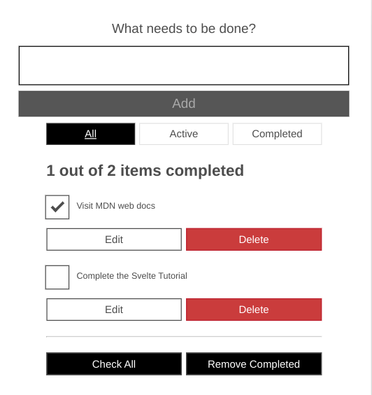

# Moz Todo Svelte

## Table of contents

- [Overview](#overview)
  - [Screenshot](#screenshot)
  - [Built With](#built-with)
- [Continued Development](#continued-development)
- [Useful Resources](#useful-resources)

## Overview

This is completed result from this [tutorial](https://developer.mozilla.org/en-US/docs/Learn/Tools_and_testing/Client-side_JavaScript_frameworks/Svelte_Todo_list_beginning).

### Screenshot

### Built With

- Svelte

## Continued Development

- Convert to Typescript

## Useful Resources 

- [Dev Samples](https://www.devsamples.com/javascript/svelte/deploy-svelte-app-gh-pages) - deploy svelte app gh pages